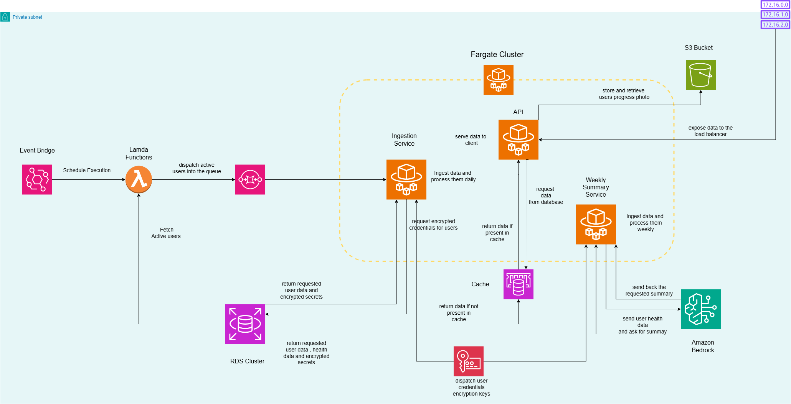

# Health Analysis Platform

A cloud-native health and fitness data platform designed to ingest, normalize, store, and analyze data from multiple external providers.

The project focuses on **data engineering, distributed ingestion, cloud infrastructure, and scalable backend architecture** rather than simply building a fitness application.

The platform is designed around a target of approximately **100,000 peak users** and deliberately uses real external APIs to model the constraints encountered in production systems: rate limits, authentication, pagination, inconsistent schemas, provider failures, retries, and horizontally scaled workers.

> **Project status:** Active development. Core ingestion and infrastructure are implemented; analytics, AI, observability, frontend, and load testing are still being developed.

---

## Architecture



The current architecture is centered around asynchronous ingestion:

```text
                    ┌─────────────────────┐
                    │    PostgreSQL/RDS   │
                    └──────────┬──────────┘
                               │
                               ▼
                    ┌─────────────────────┐
                    │  Dispatcher Lambda  │
                    └──────────┬──────────┘
                               │
                     ┌─────────┼─────────┐
                     ▼         ▼         ▼
                  Google    FatSecret   Lyfta
                   SQS        SQS        SQS
                     │         │         │
                     ▼         ▼         ▼
                  ECS       ECS        ECS
                  Workers   Workers    Workers
                     │         │         │
                     └─────────┼─────────┘
                               │
                        Provider APIs
```

Redis provides shared distributed admission control across worker tasks.

---

## Core Design Principles

### Provider-independent domain model

External providers expose different APIs, schemas, authentication mechanisms, pagination models, and naming conventions.

Those differences are isolated at the connector boundary.

```text
External API
     │
     ▼
┌─────────────────────┐
│      Connector      │
│                     │
│ authentication      │
│ pagination          │
│ rate limiting       │
│ provider parsing    │
│ schema translation  │
└──────────┬──────────┘
           │
           ▼
  Internal domain record
           │
     ┌─────┼─────┐
     ▼     ▼     ▼
  Database API Analytics AI
```

Downstream components do not depend on provider-specific response formats.

This acts as an **anti-corruption layer** between external APIs and the internal domain model.

---

## External Providers

The platform currently integrates three providers:

| Provider      | Domain                         |
| ------------- | ------------------------------ |
| Google Health | Activity and body measurements |
| FatSecret     | Nutrition                      |
| Lyfta         | Workouts and personal records  |

A provider can expose multiple domain-specific connectors.

For example:

```text
Google Health
├── NEAT connector
└── Body measurement connector

FatSecret
└── Nutrition connector

Lyfta
└── Workout connector
```

This distinction is intentional:

> **Provider ≠ Connector**

The provider determines shared infrastructure concerns such as credentials and rate limits, while connectors represent specific ingestion domains.

---

# Ingestion Pipeline

The ingestion system is asynchronous and queue-based.

```text
User
 │
 ▼
Dispatcher
 │
 ▼
Create ingestion job
 │
 ▼
SQS
 │
 ▼
ECS worker
 │
 ▼
Retrieve encrypted credentials
 │
 ▼
Provider connector
 │
 ▼
External API
 │
 ▼
Provider-independent records
 │
 ▼
Loader
 │
 ▼
PostgreSQL
```

Messages contain a job identifier rather than the complete ingestion payload.

For example:

```json
{
  "job_id": 123
}
```

The worker retrieves the job and its associated credentials from the database.

---

# Distributed Rate Limiting

External APIs impose rate and concurrency limits.

The workers therefore do not maintain independent local rate limiters.

Instead, Redis provides a shared admission-control mechanism.

```text
ECS Task 1 ─┐
ECS Task 2 ─┤
ECS Task 3 ─┼──► Redis
ECS Task N ─┘
               │
               ▼
        Provider admission
```

Limits are **provider-scoped**, not worker-scoped.

This means horizontal scaling does not multiply the effective request rate against an external API.

For example, if a provider allows a configured request rate of `N` requests/second, adding more ECS tasks does not turn that into:

```text
N × number_of_tasks
```

All workers compete for the same distributed admission control.

The implementation also tracks leases and uses lease expiration to protect against abandoned acquisitions.

---

# Horizontal Scaling

The worker code is packaged into a single container image.

The deployment model uses separate ECS services for each provider:

```text
                 Worker Image
                      │
        ┌─────────────┼─────────────┐
        ▼             ▼             ▼
   Google Worker  FatSecret Worker  Lyfta Worker
        │             │             │
   Google SQS     FatSecret SQS     Lyfta SQS
```

The same image is configured using environment variables:

```text
WORKER_PROVIDER=google_health
QUEUE_URL=<google queue>

WORKER_PROVIDER=fatsecret
QUEUE_URL=<fatsecret queue>

WORKER_PROVIDER=lyfta
QUEUE_URL=<lyfta queue>
```

This allows each ECS service to scale independently according to its own queue workload.

The worker implementation itself does not need to be duplicated.

---

# Job Lifecycle

Ingestion jobs have an explicit state machine.

```text
CREATED
   │
   ▼
QUEUED
   │
   ▼
PROCESSING
   │
   ├──────────────► COMPLETED
   │
   ▼
 FAILED
   │
   ▼
 RETRY
   │
   ▼
 QUEUED
```

Job events are persisted as immutable lifecycle events.

The database owns the transition rules.

The worker requests transitions such as:

```text
PROCESSING_STARTED
COMPLETED
FAILED
RETRY
```

and PostgreSQL validates and applies the transition atomically.

This keeps lifecycle consistency out of individual worker implementations.

---

# Failure Handling

SQS messages are deleted **only after successful processing**.

```text
SQS message
     │
     ▼
process job
     │
 ┌───┴────┐
 ▼        ▼
SUCCESS   FAILURE
 │          │
 ▼          ▼
delete    don't delete
message     │
            ▼
       visibility timeout
            │
            ▼
         redelivery
```

This allows failed jobs to be retried through SQS rather than silently losing ingestion requests.

The job itself records the failure and lifecycle event.

Long-running jobs can later be extended with visibility-timeout management as required.

---

# Credentials and Security

Provider credentials are not stored in plaintext.

The current flow is:

```text
Provider credentials
        │
        ▼
       KMS
        │
        ▼
Encrypted payload
        │
        ▼
PostgreSQL
```

Workers retrieve the encrypted credential and decrypt it through AWS KMS when processing a job.

The ECS task requires permission to perform the relevant KMS decryption operation.

Provider authentication remains isolated inside the corresponding connector.

---

# Database

The platform uses PostgreSQL on Amazon RDS.

The application uses asynchronous SQLAlchemy with `asyncpg`.

Database connectivity is centralized through the project's database connector, which handles:

* PostgreSQL connection configuration
* authentication
* TLS/SSL configuration
* connection pooling
* transaction handling
* rollback
* session cleanup

The worker does not recreate database configuration independently.

---

# Current Domain Model

The current fitness domain includes entities such as:

```text
User
 │
 ├── WorkoutSession
 │      ├── WorkoutSet
 │      └── WorkoutPR
 │
 ├── Nutrition
 │
 ├── Body Measurements
 │
 └── Activity / NEAT
```

Exercises also contain structured metadata for:

* equipment
* body parts
* target muscles
* synergist muscles

This allows the platform to derive higher-level training metrics without depending on the original provider's representation.

---

# Analytics

The planned analytics layer will derive deterministic metrics from the normalized domain model.

One example is weekly training stimulus by muscle group:

```text
Workout Sets
     │
     ▼
Exercise metadata
     │
     ▼
Target / synergist muscles
     │
     ▼
Training volume / stimulus
     │
     ▼
Weekly analytics
```

The backend will calculate these metrics deterministically.

The AI layer will explain the resulting data rather than being responsible for calculating the underlying measurements.

---

# AI Layer

The planned AI architecture uses Amazon Bedrock.

The intended separation is:

```text
PostgreSQL
     │
     ▼
Deterministic aggregation
     │
     ▼
Structured metrics
     │
     ▼
Amazon Bedrock
     │
     ▼
Human-readable summary
```

The project will also expose structured health data through MCP for interactive querying.

Vector search is intentionally not a core dependency at this stage because most of the project's data is structured:

* workouts
* sets
* exercises
* nutrition
* calories
* protein
* carbohydrates
* fats
* steps
* active minutes
* body measurements

A vector database can be introduced later if the platform accumulates meaningful unstructured information such as journals, workout notes, coaching comments, or documents.

---

# Planned Observability

The cloud deployment will eventually include:

* CloudWatch
* AWS X-Ray
* Prometheus-compatible metrics
* AWS Managed Grafana
* structured application logs

The goal is to measure actual system behavior rather than simply claiming that the architecture is scalable.

---

# Planned Load Testing

The final system will be load tested before being considered complete.

The tests will measure things such as:

* API latency
* ingestion throughput
* queue processing rate
* database behavior
* worker scaling
* provider admission behavior
* error rates
* resource utilization

The goal is to validate the architecture with measurements rather than assumptions.

---

# Technology Stack

### Backend

* Python
* FastAPI
* SQLAlchemy
* asyncpg
* PostgreSQL

### Data ingestion

* SQS
* ECS/Fargate
* Redis
* Google Health APIs
* FatSecret API
* Lyfta API

### AWS

* Amazon RDS
* AWS Lambda
* Amazon SQS
* AWS KMS
* Amazon ECS/Fargate
* Amazon ElastiCache / Valkey
* Amazon EventBridge
* Amazon Bedrock
* CloudWatch
* AWS X-Ray
* AWS Managed Grafana

### Infrastructure

* Terraform
* Docker

---

# Project Status

## Completed / Implemented

* [x] PostgreSQL domain model
* [x] Async database access
* [x] Google Health connectors
* [x] FatSecret connector
* [x] Lyfta connector
* [x] Provider-independent domain records
* [x] Provider-specific authentication
* [x] Pagination handling
* [x] Redis distributed admission control
* [x] Idempotent data loaders
* [x] Ingestion job state machine
* [x] Immutable job events
* [x] SQS dispatcher
* [x] SQS-based worker architecture
* [x] KMS-encrypted provider credentials
* [x] Lambda → SQS integration
* [x] Initial AWS networking and infrastructure
* [x] Independent provider queue architecture

## In Progress

* [ ] End-to-end local worker validation
* [ ] Docker containerization
* [ ] ECS/Fargate deployment
* [ ] Independent ECS autoscaling
* [ ] Database RBAC
* [ ] Observability
* [ ] Analytics layer
* [ ] Amazon Bedrock integration
* [ ] MCP integration
* [ ] Frontend
* [ ] Load testing

---

# Why This Project Exists

This project is deliberately more infrastructure-heavy than a typical fitness application.

The objective is to explore how a system behaves when:

* multiple providers expose incompatible APIs
* providers impose different rate limits
* credentials must be securely managed
* ingestion must survive provider failures
* workers need to scale horizontally
* database writes must remain idempotent
* jobs need observable lifecycle states
* external APIs must not leak into the rest of the application

The resulting architecture is intended to demonstrate practical experience with **data engineering, distributed systems, asynchronous processing, cloud infrastructure, and backend engineering** rather than simply demonstrating CRUD application development.

---

## Development Philosophy

The project favors explicit boundaries over premature abstraction.

External provider complexity belongs at the connector boundary.

Infrastructure concerns belong to infrastructure components.

Database lifecycle consistency belongs to PostgreSQL.

Exact analytical calculations belong to deterministic application logic.

AI is used where probabilistic language generation is useful—not where deterministic computation is required.
